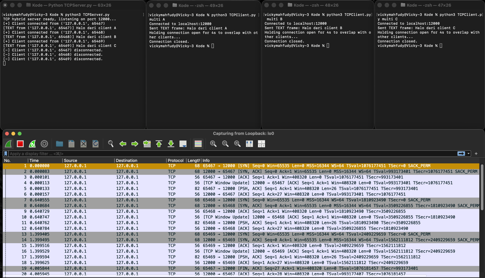
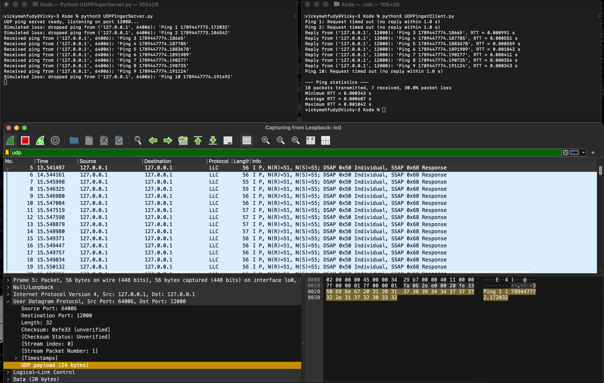
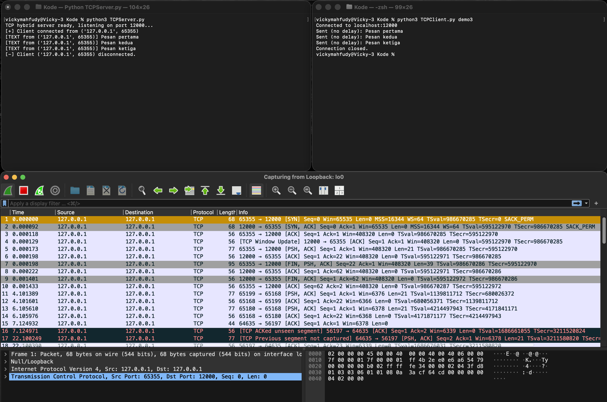

# Tugas 3: Hybrid Socket

Repo ini memuat source code sekaligus laporan analisis. Source code di
`Kode/`, jawaban Bagian A (implementasi) dan Bagian B (analisis) ada di
`README.md`, lengkap dengan bukti tangkapan layar Wireshark dan terminal. Beserta versi PDF nya ada di `Laporan_Analisis.pdf`

Sistem hybrid socket yang menggabungkan:
- **TCP multi-threaded server** untuk transmisi teks/pesan (dan file) secara konkuren,
  dengan protokol layer aplikasi buatan sendiri (length-prefixed framing) untuk
  mengatasi masalah byte-stream boundary pada TCP.
- **UDP Pinger** untuk mengukur RTT dan packet loss antara client dan server.

## Struktur Repo

```
Kode/
  TCPServer.py           # Multi-threaded TCP server (welcoming + connection socket)
  TCPClient.py            # TCP client: text, file, demo3 (no-delay), multi (concurrency demo)
  UDPPingerServer.py      # UDP ping server (single socket, simulasi packet loss)
  UDPPingerClient.py      # UDP ping client (settimeout 1.0, RTT & loss statistics)
README.md                 # Deskripsi tugas, cara menjalankan, dan hasil analisis
Laporan_Analisis.pdf      # Laporan analisis lengkap versi PDF
```

## Cara Menjalankan

Semua skrip menggunakan Python 3 standar (modul `socket`, `threading`), tidak ada
dependency eksternal.

### 1. TCP: layanan pesan/file multi-client

Jalankan server:
```bash
cd Kode
python3 TCPServer.py
```

Di terminal lain, jalankan client sesuai mode yang diinginkan:
```bash
# Kirim satu pesan teks
python3 TCPClient.py text "Halo dari client"

# Kirim file (disimpan server ke Kode/received_files/)
python3 TCPClient.py file /path/ke/file.txt

# Demo byte-stream boundary: kirim 3 pesan tanpa delay
python3 TCPClient.py demo3

# Demo multi-client: connect, kirim 1 pesan, tahan koneksi 4 detik
# (jalankan beberapa instance dengan id berbeda untuk lihat konkurensi)
python3 TCPClient.py multi A
```

### 2. UDP: ping server/client

Jalankan server (di port yang sama, 12000, tetapi UDP dan TCP punya namespace
port terpisah di OS sehingga bisa dijalankan bersamaan dengan TCPServer.py):
```bash
python3 UDPPingerServer.py
```

Jalankan client (mengirim 10 ping, timeout 1 detik per ping, lalu menampilkan
ringkasan RTT min/avg/max dan packet loss rate):
```bash
python3 UDPPingerClient.py
```

## Protokol Framing TCP

Setiap frame yang dikirim lewat koneksi TCP berbentuk:

```
[4 byte panjang N (big-endian)] [N byte payload]
```

Payload dimulai dengan 4 byte tag ASCII:
- `TEXT` + teks UTF-8
- `FILE` + 2 byte panjang nama file + nama file + isi file

Karena penerima selalu tahu persis berapa byte yang harus dibaca (length
prefix), beberapa pesan yang dikirim berturut-turut lewat `send()` tanpa
delay tidak akan pernah tergabung atau terpotong secara salah, terlepas dari
bagaimana TCP menyegmentasikannya di level transport.

---

## Laporan Analisis

### Bagian A: Implementasi Pemrograman Soket

#### A.1 Layanan TCP Multi-Client

Server (`TCPServer.py`) membuat 1 welcoming socket yang tetap terikat ke
port 12000 seumur hidup proses, hanya dipakai untuk `accept()`. Setiap
`accept()` yang berhasil menghasilkan connection socket baru, yang
langsung diserahkan ke thread worker terpisah (`threading.Thread`) untuk
melayani seluruh pertukaran data dengan client tersebut. Welcoming socket
tidak pernah dipakai untuk kirim/terima data aplikasi dan hidup selama
server berjalan, sedangkan connection socket dibuat per client, hanya
hidup selama sesi client itu, dan ditutup begitu client disconnect. Karena
kedua jenis socket ini terpisah, main thread bisa langsung `accept()`
client baru tanpa menunggu client lama selesai, itulah dasar konkurensi.

Bukti: 3 client (A, B, C) dijalankan hampir bersamaan, connect-nya
saling menyusul sebelum satu pun disconnect, dan Wireshark menunjukkan
tiga three-way handshake terpisah dari tiga port ephemeral berbeda,
semuanya menuju port 12000 yang sama.



#### A.2 Layanan UDP Pinger

Client (`UDPPingerClient.py`) memakai `clientSocket.settimeout(1.0)`
sebelum mengirim 10 ping berurutan. Jika balasan tidak datang dalam 1
detik, exception `timeout` ditangkap, ping tersebut dihitung hilang, dan
loop lanjut ke ping berikutnya tanpa pernah blocking selamanya. Di akhir
10 kali kirim, client menghitung RTT minimum/rata-rata/maksimum dari ping
yang berhasil, serta packet loss rate. Untuk mendemonstrasikan penanganan
loss secara nyata, server (`UDPPingerServer.py`) sengaja men-drop ~30%
ping yang masuk secara acak.

Hasil uji: ping 1, 2, dan 10 di-drop server sehingga client timeout tepat
pada ketiganya; ping 3-9 berhasil dibalas dengan RTT sub-milidetik.
Statistik akhir: 10 transmitted, 7 received, 30% packet loss.



### Bagian B: Analisis Mendalam & Arsitektur Jaringan

#### B.1 Byte-Stream vs Message Boundary

TCP memandang data sebagai aliran byte tanpa batas pesan: TCP boleh
menggabungkan beberapa `send()` berurutan menjadi satu segmen atau
memecah satu `send()` menjadi beberapa segmen, dan `recv()` tidak dijamin
selaras satu-satu dengan `send()`. UDP sebaliknya menjaga message
boundary: setiap `sendto()` = satu datagram utuh, setiap `recvfrom()`
mengembalikan tepat satu datagram itu, karena UDP tidak punya abstraksi
byte stream.

**Dampak teknis:** `TCPClient.py demo3` mengirim 3 pesan tanpa delay.
Wireshark membuktikan hanya **2 segmen TCP** yang benar-benar terkirim:
segmen pertama `Len=21` (pesan pertama), segmen kedua `Len=39` yaitu
gabungan pesan kedua (19 byte) dan ketiga (20 byte) yang digabung TCP
menjadi satu segmen karena dikirim tanpa delay.



**Solusi protokol aplikasi:** setiap frame diawali 4-byte length prefix
yang memberitahu penerima persis berapa byte payload yang harus dibaca.
Fungsi `recv_exact()` terus membaca sampai jumlah byte lengkap, sehingga
pemisahan pesan dilakukan di level aplikasi, bukan mengandalkan batas
`recv()`. Terbukti server tetap menampilkan 3 pesan terpisah dengan benar
meski di kabel hanya 2 segmen.

#### B.2 Analisis Skalabilitas Socket

Server TCP membuka **N + 1** soket untuk N client: 1 welcoming socket
tetap (port 12000) plus N connection socket (satu per client aktif,
dibedakan lewat 4-tuple IP/port lokal-remote). Terbukti pada demo
multi-client: 3 client = 3 connection socket + 1 welcoming socket = 4
soket total.

Server UDP hanya butuh **1 soket** karena connectionless, tidak ada
`listen()`/`accept()`/state per sesi; `recvfrom()` sekaligus memberi
alamat pengirim untuk dibalas langsung. Implikasi: server UDP memakai 1
FD dan 1 buffer kernel berapa pun banyak client, sedangkan server TCP
memakai FD dan buffer yang bertumbuh O(N), dan tiap connection socket
mengonsumsi entry tabel koneksi kernel yang membatasi jumlah koneksi
simultan secara praktis. Server UDP tidak punya batasan setara ini.

#### B.3 Evolusi Transport & QUIC

QUIC berjalan di atas UDP karena: (1) **deployability** — middlebox
internet (NAT, firewall) hanya meloloskan TCP/UDP, protokol IP baru akan
banyak di-drop; (2) **menghindari kekakuan kernel OS** — TCP ada di
kernel dan sulit diubah cepat, sedangkan di atas UDP QUIC bisa
mengimplementasikan seluruh logic transport sendiri di user-space dan
berevolusi lewat update aplikasi/library; (3) **kontrol penuh** — UDP
tidak memaksakan model reliability/ordering, sehingga QUIC bebas merancang
multiplexing sesuai kebutuhan modern.

**Solusi HOL blocking:** TCP hanya mengenal satu byte stream per koneksi,
sehingga satu segmen hilang memblokir seluruh stream setelahnya (termasuk
data resource lain yang di-multiplex, seperti HTTP/2 di atas TCP). QUIC
mengimplementasikan multiplexing di level stream native dengan buffer
reliability independen per stream: jika satu paket stream A hilang, hanya
stream A yang menunggu retransmisi, stream lain yang sudah lengkap tetap
langsung diserahkan ke aplikasi.

#### B.4 Skenario Bind Explicit pada Client

Default-nya OS memilih port ephemeral otomatis saat client pertama
mengirim data. `clientSocket.bind(('', 5432))` eksplisit memaksa socket
memakai port 5432 tetap pada semua interface lokal, bukan port ephemeral
acak.

**Apakah server masih bisa membalas:** Ya, karena balasan UDP murni
bergantung pada alamat pengirim yang tercatat di header paket yang
diterima lewat `recvfrom()`; server tinggal `sendto()` balik ke alamat
itu, berfungsi identik dengan port ephemeral biasa.

**Potensi kendala 2 instansiasi bersamaan:** Port 5432 bersifat eksklusif
per host; jika instansiasi client kedua juga mencoba bind ke port yang
sama, `bind()` akan gagal dengan `OSError: Address already in use`,
karena port sudah dipakai instansiasi pertama. Berbeda dari implicit
bind, di mana setiap instansiasi otomatis mendapat port ephemeral berbeda
dari OS sehingga banyak instansiasi bisa berjalan bersamaan tanpa
konflik.
